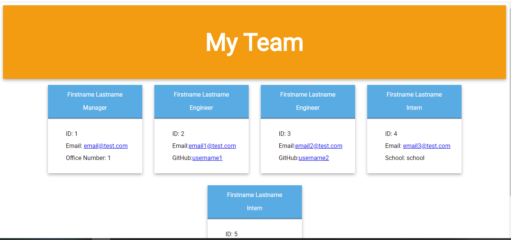

# Team Profile Generator

## General Info

A CLI application to generate a quick reference team profile generator. The user is prompted to add a series of team members and information about each one. After each employee added the user will be asked to add another employee or to exit the application. In the end it compiles all of the employees and generates an HTML document. 

To generate your own team profile simply clone this repo to your local machine and install dependencies.

## User Story 

As a manager I want to generate a webpage that displays my team's basic info so that I have quick access to emails and GitHub profiles.

## Technologies used 

* HTML
* CSS
* JavaScript
* NodeJS

## Dependencies

* Jest 24.9.0
* Inquirer 6.3.1

